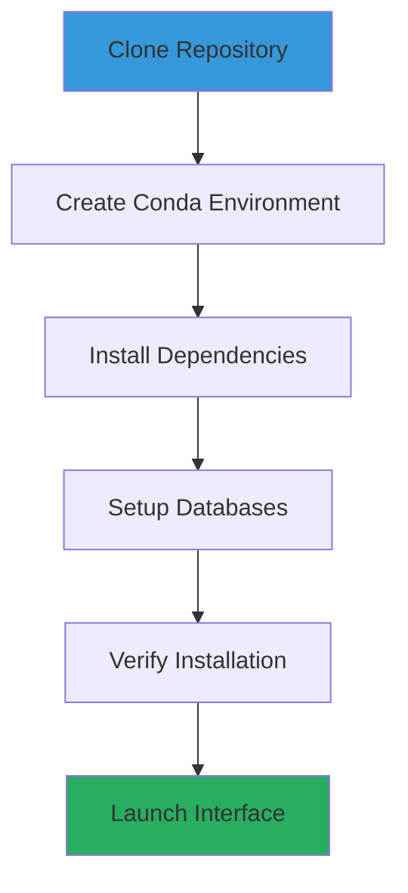
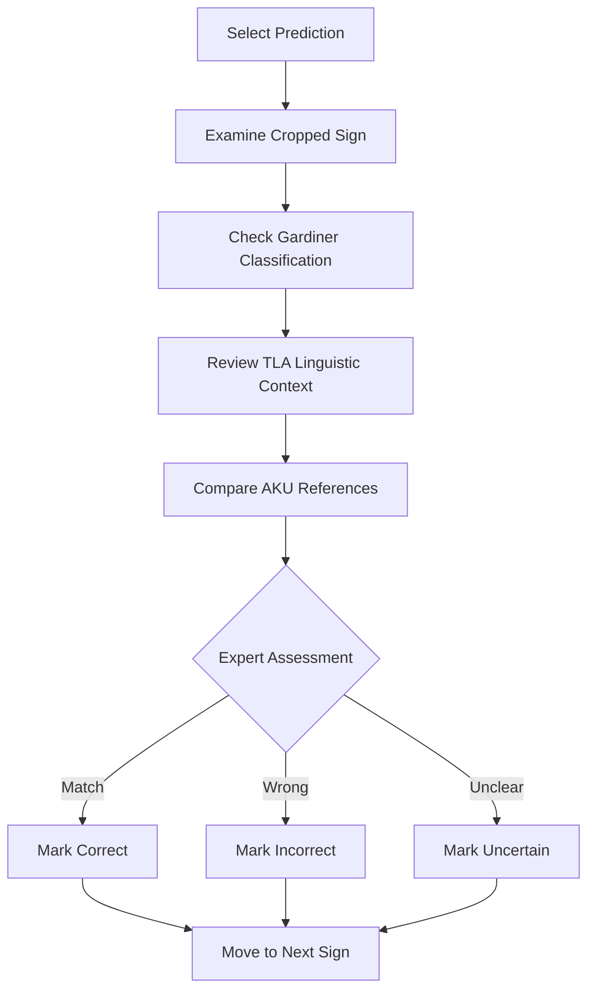

# Getting Started with HieraticAI

> **Academic Prototype Notice**: This is a methodological prototype developed for the "Ancient Language Processing" seminar at Freie Universität Berlin (Summer 2025). The project demonstrates computational approaches to ancient Egyptian paleographic analysis.

This guide will walk you through the **complete setup process from scratch**. We have multiple installation options depending on your comfort level with this method.

## One-Click Installation (Recommended)

**The easiest way to install HieraticAI - no technical knowledge required!**

### Step 1: Download HieraticAI
1. Go to [github.com/MargotBelot/HieraticAI](https://github.com/MargotBelot/HieraticAI)
2. Click the green **"Code"** button
3. Click **"Download ZIP"**
4. Extract the ZIP file to your Desktop (or anywhere you like)

### Step 2: Run the Automatic Installer

**Important**: Make sure you have **Python 3.8 or newer** installed first!
- **Windows/Mac**: Download from [python.org](https://www.python.org/downloads/)
- **Linux**: Install with `sudo apt install python3 python3-pip` (Ubuntu/Debian)

1. **Windows Users**: Double-click `install.py` in the HieraticAI folder
2. **Mac/Linux Users**: Open Terminal, navigate to the folder, and run: `python3 install.py`

**That's it!** The installer will:
- Check if you have Python 3.8+ (and tell you if you need to install it)
- Download and install all required software (~2GB)
- Create a simple launcher for you to use
- Test everything to make sure it works

### Step 3: Launch HieraticAI
After installation completes:
- **Windows**: Double-click `start_hieratic_ai.bat`
- **Mac/Linux**: Run `./start_hieratic_ai.sh`

Your web browser will open automatically with the HieraticAI interface!

---

## Manual Installation (For Experienced Users)

If you prefer to install manually or already have Python/Git:

```bash
git clone https://github.com/MargotBelot/HieraticAI.git
cd HieraticAI
python3 -m venv hieratic_env
# Windows: hieratic_env\Scripts\activate
# Mac/Linux: source hieratic_env/bin/activate
pip install -r requirements.txt
streamlit run tools/validation/prediction_validator.py
```

## System Requirements

**Before we start, make sure your computer meets these requirements:**

- **Operating System**: 
  - Windows 10 or newer
  - macOS 10.15 (Catalina) or newer  
  - Linux Ubuntu 18.04 or newer
- **Memory**: 8GB RAM minimum (16GB recommended for better performance)
- **Storage**: 5GB free disk space
- **Internet**: Stable internet connection (we'll download ~2GB of software)

> **Time needed**: First-time setup takes 15-30 minutes depending on your internet speed.

## Step 1: Install Required Software

### Option A: Using the Python Installer (Recommended for Beginners)

#### For macOS Users:
1. **Install Homebrew** (if you don't have it):
   - Open **Terminal** (press `Cmd + Space`, type "Terminal", press Enter)
   - Copy and paste this command:
   ```bash
   /bin/bash -c "$(curl -fsSL https://raw.githubusercontent.com/Homebrew/install/HEAD/install.sh)"
   ```
   - Press Enter and follow the prompts

2. **Install Python and Git**:
   ```bash
   brew install python git
   ```

#### For Linux Users:
```bash
# Ubuntu/Debian
sudo apt update
sudo apt install python3 python3-pip git

# CentOS/RHEL/Fedora
sudo yum install python3 python3-pip git
# or for newer versions:
sudo dnf install python3 python3-pip git
```

### Option B: Manual Installation

#### Step 1.1: Install Python

**Windows:**
1. Go to [python.org/downloads](https://www.python.org/downloads/)
2. Click "Download Python 3.11" (or latest version)
3. Run the downloaded file
4. **IMPORTANT**: Check "Add Python to PATH" during installation
5. Click "Install Now"

**macOS:**
1. Go to [python.org/downloads](https://www.python.org/downloads/)
2. Download the macOS installer
3. Run the `.pkg` file and follow instructions

**Linux:**
- Most Linux distributions come with Python pre-installed
- If not, use your package manager (see Linux commands above)

#### Step 1.2: Install Git

**Windows:**
1. Go to [git-scm.com](https://git-scm.com/download/win)
2. Download and run the installer
3. Use default settings (just keep clicking "Next")

**macOS:**
1. Go to [git-scm.com](https://git-scm.com/download/mac)
2. Download and install
3. Or install via Homebrew: `brew install git`

**Linux:**
```bash
# Ubuntu/Debian
sudo apt install git

# CentOS/RHEL/Fedora  
sudo yum install git
# or: sudo dnf install git
```

#### Step 1.3: Verify Installation

Open your **terminal/command prompt** and run these commands:

```bash
# Check Python (should show version 3.8 or higher)
python --version
# If that doesn't work, try:
python3 --version

# Check Git
git --version

# Check pip (Python package installer)
pip --version
# If that doesn't work, try:
pip3 --version
```

**Troubleshooting:**
- If commands don't work, you may need to restart your terminal/computer
- On Windows, if Python isn't found, make sure you checked "Add Python to PATH" during installation

## Step 2: Download HieraticAI

### Method 1: Download as ZIP (Easy for Beginners)

1. **Go to the project page**: [github.com/MargotBelot/HieraticAI](https://github.com/MargotBelot/HieraticAI)
2. **Click the green "Code" button**
3. **Click "Download ZIP"**
4. **Extract the ZIP file** to a folder like:
   - Windows: `C:\Users\YourName\HieraticAI`
   - macOS: `/Users/YourName/HieraticAI`  
   - Linux: `/home/yourname/HieraticAI`

### Method 2: Using Git (Recommended)

Open your terminal/command prompt and run:

```bash
# Navigate to where you want to install (optional)
cd Desktop  # This will install on your Desktop

# Download HieraticAI
git clone https://github.com/MargotBelot/HieraticAI.git

# Enter the project folder
cd HieraticAI
```

**What this does:**
- `git clone` downloads all the project files
- `cd HieraticAI` enters the project folder

## Step 3: Install HieraticAI Dependencies

Now we need to install the specific software that HieraticAI needs to work.

### For Most Users (Simple Method)

1. **Open your terminal/command prompt**
2. **Navigate to the HieraticAI folder**:
   ```bash
   cd path/to/HieraticAI
   # Example: cd Desktop/HieraticAI
   ```

3. **Install everything at once**:
   ```bash
   pip install -r requirements.txt
   ```

   **What this does:** Downloads and installs all the libraries HieraticAI needs (PyTorch, Streamlit, OpenCV, etc.)

4. **Wait patiently**
   - This downloads ~1-2GB of software
   - Takes 5-15 minutes depending on internet speed
   - You'll see lots of text scrolling - this is normal!

### For Advanced Users (Using Conda)

If you prefer conda (which manages dependencies better):

```bash
# Install Miniconda first: https://docs.conda.io/en/latest/miniconda.html
# Then:
conda env create -f environment.yml
conda activate hieratic-ai
```

### Verify Everything Worked

Run this command to test if installation worked:

```bash
python -c "import streamlit, torch, cv2; print('All dependencies installed successfully!')"
```

**If you see errors:**
- Check that you're in the right folder (`cd HieraticAI`)
- Try: `python3` instead of `python`
- Try: `pip3` instead of `pip`
- Restart your terminal and try again

## Step 4: Launch HieraticAI

### Easy Launch Method

1. **Make sure you're in the HieraticAI folder**:
   ```bash
   cd HieraticAI  # if not already there
   ```

2. **Start the application**:
   ```bash
   streamlit run tools/validation/prediction_validator.py
   ```

3. **Wait for it to start** (10-30 seconds)
   - You should see messages like:
   ```
   Collecting usage statistics...
   You can now view your Streamlit app in your browser.
   
   Local URL: http://localhost:8501
   Network URL: http://192.168.1.xxx:8501
   ```

4. **Open your web browser**:
   - The application should open automatically
   - If not, go to: `http://localhost:8501`

### What to Expect

**First Launch Checklist:**
- Browser opens to HieraticAI interface
- You see "HieraticAI Validator" at the top
- Left panel shows manuscript image
- Right panel shows validation controls
- No error messages in red

**If something goes wrong:**
- Check the terminal for error messages
- Make sure you're in the right folder
- Check our [Troubleshooting](#troubleshooting) section below

### You're Ready to Use HieraticAI

Once you see the interface, you can:
1. **Select signs** by clicking on colored boxes in the manuscript
2. **Review predictions** in the right panel
3. **Mark them as correct/incorrect** using the buttons
4. **Export results** when finished

---

## Using HieraticAI (Detailed Guide)

### Method 1: Using Conda (Recommended)



#### Step 1: Clone the Repository
```bash
git clone https://github.com/MargotBelot/HieraticAI.git
cd HieraticAI
```

#### Step 2: Create Conda Environment
```bash
# Create environment from YAML file (includes all dependencies)
conda env create -f environment.yml

# Activate the environment
conda activate hieratic-ai
```

#### Step 3: Verify Installation
```bash
# Check key dependencies
python -c "import streamlit; print(f'Streamlit: {streamlit.__version__}')"
python -c "import torch; print(f'PyTorch: {torch.__version__}')"
python -c "import cv2; print(f'OpenCV: {cv2.__version__}')"
```

### Method 2: Using pip

#### Step 1: Create Virtual Environment
```bash
# Clone repository
git clone https://github.com/MargotBelot/HieraticAI.git
cd HieraticAI

# Create virtual environment
python -m venv hieratic_env

# Activate environment
# On Windows:
hieratic_env\Scripts\activate
# On macOS/Linux:
source hieratic_env/bin/activate
```

#### Step 2: Install Dependencies
```bash
pip install -r requirements.txt
```

## Database Setup

HieraticAI integrates with two key databases for linguistic and paleographic context:

### TLA Database Integration
```bash
# The TLA integration is built into the validator
# No separate setup required - fallback strategies ensure 100% coverage
python -c "
from pathlib import Path
import sys
sys.path.append(str(Path('./tools/validation')))
from prediction_validator import PredictionValidator
validator = PredictionValidator()
print('TLA integration ready')
"
```

### AKU Database Setup
```bash
# Check if AKU data is accessible
python -c "
from pathlib import Path
aku_path = Path('./external_data/AKU Westcar Scraping')
if aku_path.exists():
    print('AKU database found')
else:
    print('AKU database not found - some reference features unavailable')
"
```

## First Launch

### Launch the Validation Interface

```bash
# Make sure you're in the project directory
cd HieraticAI

# Activate your environment (if not already active)
conda activate hieratic-ai
# or: source hieratic_env/bin/activate

# Option 1: Direct script execution
streamlit run tools/validation/prediction_validator.py

# Option 2: Install package and use CLI (recommended)
pip install -e .
hieratic-validate
```

### Expected Output
```
  You can now view your Streamlit app in your browser.

  Local URL: http://localhost:8501
  Network URL: http://192.168.1.XXX:8501
```

### Interface Tour

When the interface loads, you'll see a clean, intuitive layout:

**HieraticAI Validator - Status: Ready**

**Left Panel: Control Center**
- **Database Status**
  - TLA: Active
  - AKU: Connected
- **Settings**
  - Confidence Threshold: 0.30 (adjustable slider)
  - Filter options for prediction confidence
- **Navigation**
  - Previous/Next buttons for sign navigation
  - Refresh button to reload predictions
- **Progress Tracking**
  - Visual progress bar: ████▓▓▓▓ 67%
  - Real-time completion statistics

**Right Panel: Validation Workspace**
- **Papyrus Image Display**
  - Full Westcar manuscript view
  - Colored bounding boxes around detected signs
  - Click-to-select functionality for individual signs
- **Sign Review Panel**
  - Cropped image of selected sign
  - Gardiner code information and Unicode display
  - TLA linguistic data (transliteration, translation, frequency)
  - AKU reference signs for comparison
- **Validation Actions**
  - **Correct** - Mark prediction as accurate
  - **Incorrect** - Mark prediction as wrong
  - **Uncertain** - Mark for further review

**Bottom Panel: Live Statistics**
- Reviewed: 45/67 predictions
- Current accuracy: 89%
- Session duration: 23 minutes

## Your First Validation Session

### Step 1: Understand the Interface

The interface displays:
- **Left Panel**: Westcar Papyrus image with colored bounding boxes
- **Right Panel**: Validation controls and detailed sign information
- **Bottom**: Progress statistics and export options

### Step 2: Adjust Confidence Threshold

Start with the default threshold (0.3) to see all predictions:
- **High confidence (0.8-1.0)**: Likely correct predictions
- **Medium confidence (0.5-0.8)**: Review carefully  
- **Low confidence (0.0-0.5)**: Often need correction

### Step 3: Select Your First Prediction

1. Look at the manuscript image - you'll see numbered bounding boxes
2. In the right panel, use the dropdown: `Select a prediction...`
3. Choose: `[PENDING] 1. A1 (conf: 0.85)` (example)

### Step 4: Review the Sign Context

For the selected prediction, examine:
- **Cropped Image**: Isolated view of the detected sign
- **Gardiner Info**: Code, Unicode character, description  
- **TLA Data**: Transliteration, translation, frequency
- **AKU References**: Similar signs from the database

### Step 5: Make Your First Validation

Based on your expert assessment:
- Click **Correct** if the AI prediction is accurate
- Click **Incorrect** if wrong classification or bounding box
- Click **Uncertain** for ambiguous or damaged signs

### Step 6: Track Your Progress

Watch the statistics update in real-time:
- **Progress Bar**: Shows validation completion
- **Accuracy Metrics**: Running accuracy percentage
- **Distribution Chart**: Breakdown of validation outcomes

## Best Practices for Validation

### Academic Validation Approach



### Efficiency Tips

1. **Start with High Confidence**: Validate obvious correct predictions first
2. **Batch Similar Signs**: Group similar Gardiner codes for consistency
3. **Use Reference Context**: Always check TLA and AKU data before deciding
4. **Take Breaks**: Maintain concentration for accurate validation
5. **Export Regularly**: Save your progress with CSV exports

## Customization Options

### Adjust Interface Settings

```python
# In the interface, you can:
# - Modify confidence threshold with sidebar slider
# - Filter predictions by confidence range
# - Change image crop padding for better sign visibility
# - Toggle between different database views
```

### Export and Analysis

```bash
# Export validation results
# Click "Export Validation Results" button in interface
# Downloads CSV with:
# - image_id, gardiner_code, confidence
# - validation_status, bbox_coordinates, timestamp
```

## Troubleshooting

### Common Issues

#### Interface Won't Load
```bash
# Check if all dependencies installed
pip list | grep streamlit
pip list | grep torch

# Try clearing Streamlit cache
streamlit cache clear

# Restart with verbose output
streamlit run scripts/prediction_validator.py --logger.level=debug
```

#### Database Connection Issues
```bash
# Check file paths exist
ls -la data/
ls -la "AKU Westcar Scraping/"

# Verify prediction file exists
ls -la output/*/coco_instances_results_FIXED.json
```

#### Memory Issues
```bash
# For low-memory systems:
export STREAMLIT_SERVER_MAX_UPLOAD_SIZE=200
export STREAMLIT_SERVER_MAX_MESSAGE_SIZE=200

# Or use CPU-only mode
export CUDA_VISIBLE_DEVICES=""
```

### Getting Help

If you encounter issues:

1. **Check Prerequisites**: Verify Python version and dependencies
2. **Review Error Messages**: Look for specific error details in terminal
3. **Check File Permissions**: Ensure read/write access to project directories
4. **Update Dependencies**: Try `pip install --upgrade -r requirements.txt`
5. **GitHub Issues**: Report bugs at [GitHub Issues](https://github.com/MargotBelot/HieraticAI/issues)

## Next Steps

Next, explore:

- **[Technical Guide](TECHNICAL_GUIDE.md)**: Advanced features and customization
- **Validation Best Practices**: Develop systematic validation workflows
- **Research Applications**: Integrate results into your research
- **Contributing**: Help improve HieraticAI for the academic community

## Support

Need additional help?
- **Documentation**: Check the Technical Guide for advanced topics
- **Bug Reports**: Use GitHub Issues with detailed error information
- **Feature Requests**: Suggest improvements through GitHub Discussions
  
---
