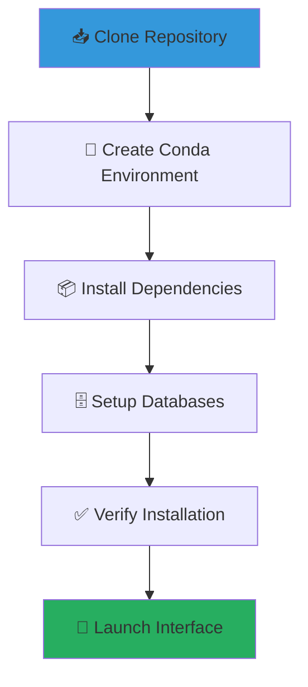
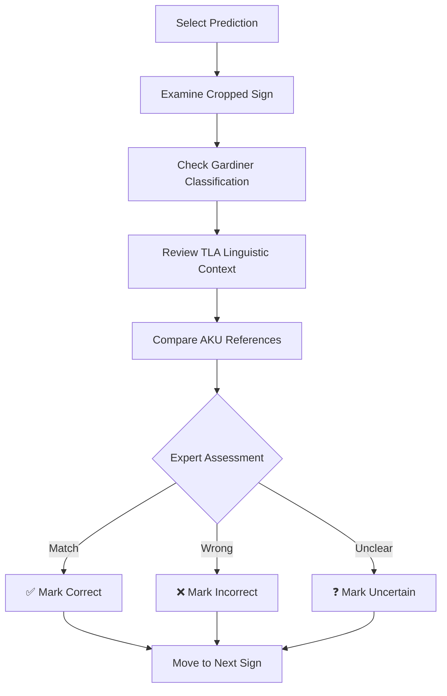

# Getting Started with HieraticAI 🚀

Welcome to HieraticAI! This guide will walk you through the complete setup process, from installation to your first validation session.

## 📋 Prerequisites

Before starting, ensure you have:

### System Requirements
- **Operating System**: Windows 10+, macOS 10.15+, or Linux Ubuntu 18.04+
- **Python**: Version 3.8 or higher
- **Memory**: 8GB RAM minimum (16GB recommended)
- **Storage**: 5GB free space
- **Internet**: Required for downloading dependencies and databases

### Software Prerequisites
```bash
# Check Python version
python --version  # Should be 3.8+

# Check if conda is available (recommended)
conda --version

# Or use pip if conda not available
pip --version
```

## 🔧 Installation

### Method 1: Using Conda (Recommended)



#### Step 1: Clone the Repository
```bash
git clone https://github.com/MargotBelot/HieraticAI.git
cd HieraticAI
```

#### Step 2: Create Conda Environment
```bash
# Create environment from YAML file (includes all dependencies)
conda env create -f environment.yml

# Activate the environment
conda activate hieratic-ai
```

#### Step 3: Verify Installation
```bash
# Check key dependencies
python -c "import streamlit; print(f'✅ Streamlit: {streamlit.__version__}')"
python -c "import torch; print(f'✅ PyTorch: {torch.__version__}')"
python -c "import cv2; print(f'✅ OpenCV: {cv2.__version__}')"
```

### Method 2: Using pip

#### Step 1: Create Virtual Environment
```bash
# Clone repository
git clone https://github.com/MargotBelot/HieraticAI.git
cd HieraticAI

# Create virtual environment
python -m venv hieratic_env

# Activate environment
# On Windows:
hieratic_env\Scripts\activate
# On macOS/Linux:
source hieratic_env/bin/activate
```

#### Step 2: Install Dependencies
```bash
pip install -r requirements.txt
```

## 🗄️ Database Setup

HieraticAI integrates with two key databases for linguistic and paleographic context:

### TLA Database Integration
```bash
# The TLA integration is built into the validator
# No separate setup required - fallback strategies ensure 100% coverage
python -c "
from scripts.prediction_validator import PredictionValidator
validator = PredictionValidator()
print('✅ TLA integration ready')
"
```

### AKU Database Setup
```bash
# Check if AKU data is accessible
python -c "
from pathlib import Path
aku_path = Path('./AKU Westcar Scraping')
if aku_path.exists():
    print('✅ AKU database found')
else:
    print('⚠️ AKU database not found - some reference features unavailable')
"
```

## 🚀 First Launch

### Launch the Validation Interface

```bash
# Make sure you're in the project directory
cd HieraticAI

# Activate your environment (if not already active)
conda activate hieratic-ai
# or: source hieratic_env/bin/activate

# Launch the interface
streamlit run scripts/prediction_validator.py
```

### Expected Output
```
  You can now view your Streamlit app in your browser.

  Local URL: http://localhost:8501
  Network URL: http://192.168.1.XXX:8501
```

### Interface Tour

When the interface loads, you'll see:

```
🏠 HieraticAI Prediction Validator
━━━━━━━━━━━━━━━━━━━━━━━━━━━━━━━━━━━━━━━━━━━━━━━━━━━━━

📖 How to use this interface                    [Expand ▼]

┌─────────────────────────────┐  ┌─────────────────────────┐
│        📊 Sidebar           │  │      📜 Main Interface   │
│                             │  │                         │
│  🗄️ Database Status         │  │  📷 Manuscript Image    │
│   ✅ TLA: Connected         │  │  with bounding boxes    │
│   ✅ AKU: Connected         │  │                         │
│                             │  │  🔍 Validation Panel    │
│  🎚️ Confidence Threshold    │  │  with detailed review  │
│   [     0.3     ]           │  │                         │
│                             │  │  📊 Statistics          │
│  📱 Navigation Controls     │  │  and progress tracking  │
└─────────────────────────────┘  └─────────────────────────┘
```

## 📚 Your First Validation Session

### Step 1: Understand the Interface

The interface displays:
- **Left Panel**: Westcar Papyrus image with colored bounding boxes
- **Right Panel**: Validation controls and detailed sign information
- **Bottom**: Progress statistics and export options

### Step 2: Adjust Confidence Threshold

Start with the default threshold (0.3) to see all predictions:
- **High confidence (0.8-1.0)**: Likely correct predictions
- **Medium confidence (0.5-0.8)**: Review carefully  
- **Low confidence (0.0-0.5)**: Often need correction

### Step 3: Select Your First Prediction

1. Look at the manuscript image - you'll see numbered bounding boxes
2. In the right panel, use the dropdown: `Select a prediction...`
3. Choose: `[PENDING] 1. A1 (conf: 0.85)` (example)

### Step 4: Review the Sign Context

For the selected prediction, examine:
- **📷 Cropped Image**: Isolated view of the detected sign
- **📝 Gardiner Info**: Code, Unicode character, description  
- **📚 TLA Data**: Transliteration, translation, frequency
- **🏛️ AKU References**: Similar signs from the database

### Step 5: Make Your First Validation

Based on your expert assessment:
- Click **✅ Correct** if the AI prediction is accurate
- Click **❌ Incorrect** if wrong classification or bounding box
- Click **❓ Uncertain** for ambiguous or damaged signs

### Step 6: Track Your Progress

Watch the statistics update in real-time:
- **Progress Bar**: Shows validation completion
- **Accuracy Metrics**: Running accuracy percentage
- **Distribution Chart**: Breakdown of validation outcomes

## 🎯 Best Practices for Validation

### Academic Validation Approach



### Efficiency Tips

1. **Start with High Confidence**: Validate obvious correct predictions first
2. **Batch Similar Signs**: Group similar Gardiner codes for consistency
3. **Use Reference Context**: Always check TLA and AKU data before deciding
4. **Take Breaks**: Maintain concentration for accurate validation
5. **Export Regularly**: Save your progress with CSV exports

## 🔧 Customization Options

### Adjust Interface Settings

```python
# In the interface, you can:
# - Modify confidence threshold with sidebar slider
# - Filter predictions by confidence range
# - Change image crop padding for better sign visibility
# - Toggle between different database views
```

### Export and Analysis

```bash
# Export validation results
# Click "Export Validation Results" button in interface
# Downloads CSV with:
# - image_id, gardiner_code, confidence
# - validation_status, bbox_coordinates, timestamp
```

## ⚠️ Troubleshooting

### Common Issues

#### Interface Won't Load
```bash
# Check if all dependencies installed
pip list | grep streamlit
pip list | grep torch

# Try clearing Streamlit cache
streamlit cache clear

# Restart with verbose output
streamlit run scripts/prediction_validator.py --logger.level=debug
```

#### Database Connection Issues
```bash
# Check file paths exist
ls -la data/
ls -la "AKU Westcar Scraping/"

# Verify prediction file exists
ls -la output/*/coco_instances_results_FIXED.json
```

#### Memory Issues
```bash
# For low-memory systems:
export STREAMLIT_SERVER_MAX_UPLOAD_SIZE=200
export STREAMLIT_SERVER_MAX_MESSAGE_SIZE=200

# Or use CPU-only mode
export CUDA_VISIBLE_DEVICES=""
```

### Getting Help

If you encounter issues:

1. **Check Prerequisites**: Verify Python version and dependencies
2. **Review Error Messages**: Look for specific error details in terminal
3. **Check File Permissions**: Ensure read/write access to project directories
4. **Update Dependencies**: Try `pip install --upgrade -r requirements.txt`
5. **GitHub Issues**: Report bugs at [GitHub Issues](https://github.com/MargotBelot/HieraticAI/issues)

## 🎉 Next Steps

Congratulations! You now have HieraticAI running. Next, explore:

- **[Technical Guide](TECHNICAL_GUIDE.md)**: Advanced features and customization
- **Validation Best Practices**: Develop systematic validation workflows
- **Research Applications**: Integrate results into your Egyptological research
- **Contributing**: Help improve HieraticAI for the academic community

## 📞 Support

Need additional help?
- 📖 **Documentation**: Check the Technical Guide for advanced topics
- 🐛 **Bug Reports**: Use GitHub Issues with detailed error information
- 💡 **Feature Requests**: Suggest improvements through GitHub Discussions
- 📧 **Academic Collaboration**: Contact for research partnerships

---

**🎯 Ready to advance digital paleography? Start validating your first hieratic signs!**
