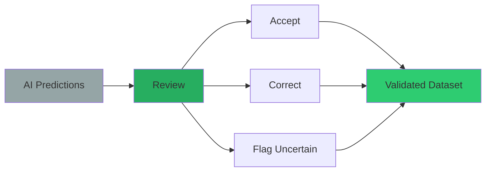
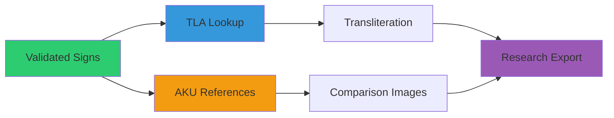
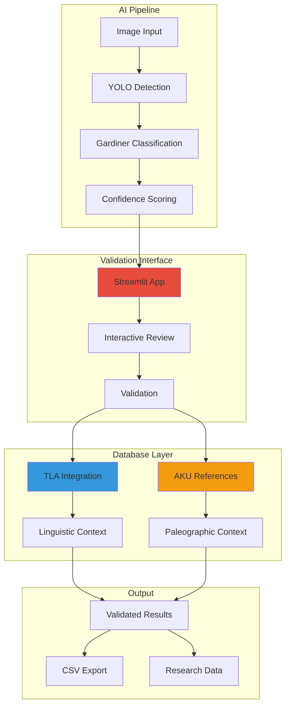

# HieraticAI

**AI-powered hieratic character recognition and validation for ancient Egyptian manuscripts**

[](https://choosealicense.com/licenses/mit/)
[](https://www.python.org/downloads/)
[](https://streamlit.io/)
[](https://github.com/MargotBelot/HieraticAI)

> **Academic Project Notice**: This is a prototype developed for the "Ancient Language Processing" seminar at Freie Universität Berlin (Summer 2025). The project serves as a methodological exploration rather than a production-ready system.
> 
> **Course Information**: [Ancient Language Processing 2025](https://digitalpasts.github.io/alp-course-2025/) - Hybrid seminar focusing on computational approaches to ancient datasets and digital philology methods.

## Table of Contents

- [HieraticAI](#hieraticai)
  - [Table of Contents](#table-of-contents)
  - [Project Overview](#project-overview)
    - [The Problem We Solve](#the-problem-we-solve)
    - [Our Solution](#our-solution)
  - [How HieraticAI Works: Step-by-Step Process](#how-hieraticai-works-step-by-step-process)
    - [Step 1: Image Processing \& AI Detection](#step-1-image-processing--ai-detection)
    - [Step 2: Interactive Validation \& Review](#step-2-interactive-validation--review)
    - [Step 3: Database Integration \& Context](#step-3-database-integration--context)
  - [Manuscript Focus: The Westcar Papyrus](#manuscript-focus-the-westcar-papyrus)
    - [Introduction to the Westcar Papyrus](#introduction-to-the-westcar-papyrus)
  - [Quick Start](#quick-start)
    - [One-Click Installation (Recommended)](#one-click-installation-recommended)
    - [Manual Installation (For Experienced Users)](#manual-installation-for-experienced-users)
  - [Interactive Validation Interface](#interactive-validation-interface)
    - [Real-Time Validation Workflow](#real-time-validation-workflow)
      - [**Main Interface Layout**](#main-interface-layout)
    - [Enhanced Status System](#enhanced-status-system)
    - [Advanced Validation Features](#advanced-validation-features)
      - [**Smart Navigation**](#smart-navigation)
      - [**Context-Rich Display**](#context-rich-display)
      - [**Expert Tools**](#expert-tools)
    - [Color-Coded Status System](#color-coded-status-system)
  - [Database Integration](#database-integration)
    - [AKU-PAL (Altägyptische Kursivschriften)](#aku-pal-altägyptische-kursivschriften)
      - [About AKU-PAL](#about-aku-pal)
      - [Integration Features](#integration-features)
    - [TLA (Thesaurus Linguae Aegyptiae) Integration](#tla-thesaurus-linguae-aegyptiae-integration)
      - [About TLA](#about-tla)
      - [Integration Architecture](#integration-architecture)
    - [Database Synchronization](#database-synchronization)
  - [Model Performance](#model-performance)
  - [Academic Applications](#academic-applications)
    - [Research Use Cases](#research-use-cases)
    - [Integration Possibilities](#integration-possibilities)
  - [Technical Architecture](#technical-architecture)
  - [Documentation](#documentation)
  - [Acknowledgments](#acknowledgments)
    - [Academic Context](#academic-context)
    - [Project Status](#project-status)
  - [Contributing](#contributing)
  - [License](#license)
  - [Citation](#citation)

## Project Overview

HieraticAI focuses on the study of ancient Egyptian manuscripts by combining computer vision with Egyptological expertise. This system automatically detects, classifies, and validates hieratic characters in papyrus images, with specialized focus on the **Westcar Papyrus**.

**What makes HieraticAI unique:**
- **AI-First Approach**: Advanced YOLO-based detection with 84 Gardiner code classes
- **Expert Validation**: Interactive interface for Egyptologists to review and correct AI predictions
- **Comprehensive Integration**: Direct links to TLA (Thesaurus Linguae Aegyptiae) and AKU databases
- **Research-Ready**: Exports validated data for paleographic and linguistic research

### The Problem We Solve

Traditional hieratic manuscript analysis is:
- **Time-consuming**: Manual character identification takes a long time for a single manuscript
- **Limited scale**: Impossible to analyze large corpora without automation
- **Subjective**: Difficult to maintain consistency across different scholars

### Our Solution

HieraticAI provides:
- **Automated Detection**: AI identifies and classifies characters in seconds
- **High Accuracy**: Trained specifically on the Westcar papyrus hieratic forms
- **Expert Oversight**: Validation interface ensures rigor
- **Rich Context**: Integrated linguistic and paleographic resources

## How HieraticAI Works: Step-by-Step Process

### Step 1: Image Processing & AI Detection


### Step 2: Interactive Validation & Review


### Step 3: Database Integration & Context


## Manuscript Focus: The Westcar Papyrus

### Introduction to the Westcar Papyrus

**Westcar Papyrus (pBerlin P 3033)** is one of the most significant Middle Kingdom hieratic manuscripts, containing a collection of tales about magicians at the court of King Khufu.

**Manuscript Details:**
- **Current Location**: Ägyptisches Museum und Papyrussammlung, Berlin
- **Inventory Number**: P 3033
- **Date**: 17th Dynasty, Second Intermediate Period (recounting events from the 4th Dynasty)
- **Script**: Hieratic
- **Language**: Middle Egyptian
- **Text Category**: Narrative literature

**Historical Context:**
- **Setting**: 4th Dynasty (Old Kingdom) under the rule of King Khufu
- **Structure**: 5 stories, each narrated by one of Khufu's sons to their father
- **Physical Structure**: 12 columns across 3 papyrus fragments
- **Literary Significance**: Provides insights into Old Kingdom royal ideology and Middle Kingdom narrative techniques

**Research Focus:**
- **Section Analyzed**: Recto VIII, lines 5-24
- **Paleographic Importance**: Key text for understanding Middle Kingdom hieratic character evolution
- **AI Training Dataset**: Primary source for hieratic character recognition model training

## Quick Start

### One-Click Installation (Recommended)

**Perfect for anyone - no technical experience required!**

**Prerequisites**: You need Python 3.8+ installed on your system. If you don't have it:
- **Windows/Mac**: Download from [python.org](https://www.python.org/downloads/) 
- **Linux**: Install with `sudo apt install python3 python3-pip` (Ubuntu) or equivalent

1. **Download**: Go to [github.com/MargotBelot/HieraticAI](https://github.com/MargotBelot/HieraticAI) and click "Download ZIP"
2. **Extract**: Unzip the file to your Desktop
3. **Install**: Double-click `install.py` (Windows) or run `python3 install.py` (Mac/Linux)
4. **Launch**: Use the created launcher script when installation completes
5. **Validate**: Your browser opens automatically to start validating!

### Manual Installation (For Experienced Users)

**Requires Python 3.8+**

```bash
git clone https://github.com/MargotBelot/HieraticAI.git
cd HieraticAI
python3 -m venv hieratic_env
# Activate: hieratic_env\Scripts\activate (Win) or source hieratic_env/bin/activate (Mac/Linux)
pip install -r requirements.txt
streamlit run tools/validation/prediction_validator.py
```

**Then navigate to `http://localhost:8501` in your browser!**

## Interactive Validation Interface

### Real-Time Validation Workflow

The HieraticAI interface provides a validation panel:

#### **Main Interface Layout**

**Manuscript Viewer (Left Panel)**
- **Westcar Papyrus Display**: Testing area view with detected signs of the Westcar papyrus facsimile.
- **Color-coded Predictions**:
  - 🔵 ① A1 (85%) - Pending validation
  - 🟢 ② G17 (92%) - High confidence, likely correct
  - 🔴 ③ M17 (76%) - Flagged for review
  - 🟠 ④ D21 (68%) - Medium confidence
  - 🔵 ⑤ N35 (54%) - Low confidence, needs attention
- **Status Tracking**: "2/5 reviewed" with progress indicator

**Validation Panel (Right Panel)**
- **Current Sign Review**:
  - Cropped image of selected sign
  - Gardiner code: A1
  - Unicode display: 𓀀
- **TLA Linguistic Data**:
  - Transliteration information
  - Lemma details and meanings
  - Related sign forms
- **AKU Reference Signs**:
  - Similar signs from database
  - Quality assessment scores
  - SVG vector displays
- **Validation Actions**:
  - **CORRECT** - Confirm AI prediction
  - **INCORRECT** - Mark as wrong
  - **UNCERTAIN** - Flag for further review
  - **EDIT CODE** - Manual correction

**Control Panel (Bottom)**
- Navigation: Previous/Next/Refresh buttons
- Progress: ████▒▒▒ 67% completion

### Enhanced Status System

| Symbol | Status | Confidence | Action Required |
|--------|--------|------------|----------------|
| 🔵 | **Pending** | Any | Needs review |
| 🟢 | **Validated** | High (>80%) | Expert confirmed |
| 🔴 | **Incorrect** | Any | AI prediction wrong |
| 🟠 | **Uncertain** | Medium | Expert unsure |

### Advanced Validation Features

#### **Smart Navigation**
- **Quick Jump**: Go directly to uncertain or low-confidence predictions
- **Progress Tracking**: Visual progress bar with completion statistics

#### **Context-Rich Display**
- **Zoom & Pan**: Detailed examination of character details
- **Measurements**: Pixel-level dimensions and positioning
- **Overlay Options**: Toggle AI predictions, ground truth, reference grids

#### **Expert Tools**
- **Manual Correction**: Edit Gardiner codes directly
- **Notes System**: Add scholarly comments and observations
- **Cross-References**: Link to related signs in other manuscripts

### Color-Coded Status System

| Color | Status | Meaning |
|-------|--------|---------|
| 🔵 **Blue** | Pending | Awaiting validation |
| 🟢 **Green** | Correct | AI prediction is accurate |
| 🔴 **Red** | Incorrect | AI prediction needs correction |
| 🟠 **Orange** | Uncertain | Requires expert judgment |

## Database Integration

HieraticAI integrates with two major academic databases to provide comprehensive linguistic and paleographic context for hieratic character validation.

### AKU-PAL (Altägyptische Kursivschriften)

#### About AKU-PAL
**Full Name**: Dynamische Paläographie des Hieratischen und der Kursivhieroglyphen  
**Link**: https://aku-pal.uni-mainz.de/  
**Institution**: Academy of Sciences and Literature, Mainz  
**Purpose**: Online platform featuring digital paleography of hieratic and cursive hieroglyphs

#### Integration Features
**Westcar Papyrus Filtering:**
- **Date Filter**: "Second Intermediate Period, 17th Dynasty"
- **Source Filter**: "Berlin, Egyptian Museum and Papyrus Collection, P. 3033"
- **Sorting Options**: Manuel de Codage (MdC), Moller No., AKU No., Date

**Metadata Extraction:**
- **Dating**: Precise chronological placement for paleographic comparison
- **Manuscript Title**: Ensures signs are sourced from the Westcar Papyrus corpus
- **Quality Assessment**: Readability, completeness, and ink clarity ratings
- **Visual Resources**: High-quality facsimiles and photographic snippets

**Research Applications:**
- **Paleographic Comparison**: Compare AI predictions with authenticated Westcar signs
- **Diachronic Analysis**: Track character evolution within the manuscript tradition
- **Quality Validation**: Cross-reference with expert-curated paleographic data

### TLA (Thesaurus Linguae Aegyptiae) Integration

#### About TLA
**Purpose**: Comprehensive lexicographical database of ancient Egyptian language  
**Content**: Scraped metadata including transliterations, translations, and frequency data  
**Coverage**: Extensive lemma database with hierarchical sign relationships

#### Integration Architecture


**Coverage Strategy:**
1. **Direct TLA Match**: Authentic lemma data with transliteration and translation
2. **Fallback Mapping**: Similar sign substitution (e.g., A23A → A23)
3. **Manual Entries**: Expert-curated data for missing signs
4. **Gardiner Fallback**: Basic classification as last resort

**Scraped Metadata Include:**
- **Transliteration**: Conventional romanization of hieratic signs
- **Translation**: English meanings and semantic ranges
- **Frequency Data**: Usage statistics across the Egyptian corpus
- **Lemma Relationships**: Connections to related lexical entries

### Database Synchronization

**Automated Indexing:**
- AKU-PAL signs filtered by Westcar Papyrus provenance
- TLA lemma data indexed by Gardiner code classification
- Cross-referencing between paleographic and linguistic data

**Real-time Integration:**
- Live database queries during validation sessions
- Cached results for performance optimization
- Fallback mechanisms ensure 100% coverage

## Model Performance

| Metric | Value |
|--------|-------|
| **Detection Model** | YOLO-based object detection |
| **Categories** | 84 Gardiner code classes |
| **TLA Coverage** | 100% (with fallback strategies) |
| **AKU Integration** | Reference signs from Westcar corpus |
| **Validation Interface** | Real-time review |

## Academic Applications

### Research Use Cases
- **Digital Paleography**: Character evolution and regional variations
- **Corpus Analysis**: Large-scale analysis of hieratic manuscripts

### Integration Possibilities
- **Museum Collections**: Digitization and cataloging assistance
- **Digital Humanities**: Integration with manuscript databases
- **Egyptology Workflows**: Support for epigraphic documentation

## Technical Architecture



## Documentation

- **[Getting Started](GETTING_STARTED.md)**: Step-by-step installation and first use
- **[Technical Guide](TECHNICAL_GUIDE.md)**: Advanced usage, customization, and development

## Acknowledgments

### Academic Context
This prototype was developed as part of the **"Ancient Language Processing" seminar** at **Freie Universität Berlin** (Summer 2025). The course focuses on computational approaches to ancient datasets, digital philology methods, and emerging research questions in ancient Near Eastern studies.

**Course Details:**
- **Institution**: Freie Universität Berlin
- **Course**: Ancient Language Processing 2025
- **Objective**: Methodological exploration of ancient language processing technologies
- **Course Website**: https://digitalpasts.github.io/alp-course-2025/

### Project Status
**Important Note**: This is a **methodological prototype** created for educational and research exploration purposes. It is not intended as a production system but rather as a proof-of-concept for applying modern AI techniques to ancient Egyptian paleographic analysis.

## Contributing

We welcome contributions from Egyptologists, computer vision researchers, and digital humanities scholars, particularly those interested in computational approaches to ancient manuscripts.

## License

This project is licensed under the MIT License - see the [LICENSE](LICENSE) file for details.

## Citation

If you use HieraticAI in your research, please cite:

```bibtex
@software{belotcolyer2025hieraticai,
  title={HieraticAI: AI-powered hieratic character recognition for ancient Egyptian manuscripts},
  author={Belot, Margot and Colyer, Dominique},
  year={2025},
  url={https://github.com/MargotBelot/HieraticAI}
}
```
---
