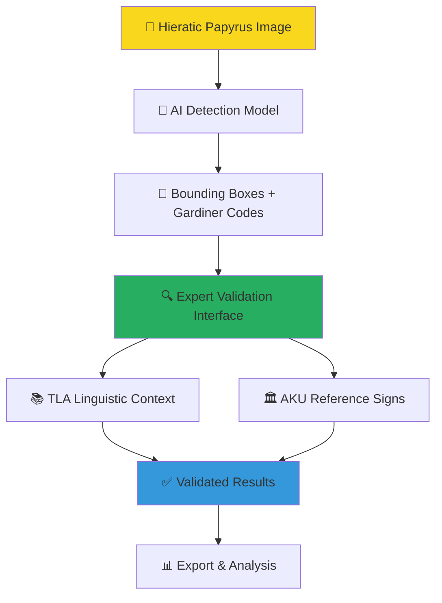
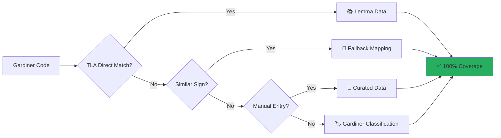
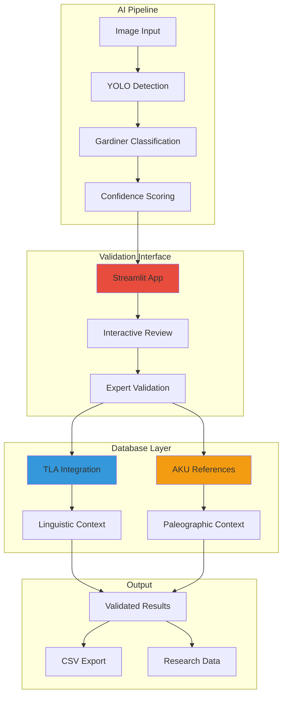

# HieraticAI 📜

**AI-powered hieratic character recognition and validation for ancient Egyptian manuscripts**

[](https://choosealicense.com/licenses/mit/)
[](https://www.python.org/downloads/)
[](https://streamlit.io/)

HieraticAI combines cutting-edge computer vision with Egyptological expertise to detect and classify hieratic characters in ancient Egyptian papyri, with specialized focus on the Middle Kingdom **Westcar Papyrus**.

## 🎯 What Does HieraticAI Do?



## 🏛️ Manuscript Focus

**Westcar Papyrus (pBerlin P 3033)**
- **Period**: Middle Kingdom (12th Dynasty, ~1800 BCE)
- **Content**: Tales of the magicians at Khufu's court
- **Section**: Recto VIII, lines 5-24
- **Significance**: Key text for Middle Kingdom hieratic paleography

## ⚡ Quick Start

### 1️⃣ Installation
```bash
git clone https://github.com/MargotBelot/HieraticAI.git
cd HieraticAI
conda env create -f environment.yml
conda activate hieratic-ai
```

### 2️⃣ Launch Validation Interface
```bash
streamlit run scripts/prediction_validator.py
```

### 3️⃣ Open in Browser
Navigate to `http://localhost:8501` and start validating!

## 🔍 Interface Overview

### Visual Validation Workflow

```
┌─────────────────────────────────────┐    ┌─────────────────────────┐
│           📜 Manuscript             │    │    🔍 Validation Panel  │
│                                     │    │                         │
│  🔵#1 A1 (0.85) ──────────────────► │    │  Select: [PENDING] 1.   │
│  🟢#2 G17 (0.92) ─────────────────► │    │    A1 (conf: 0.85)      │
│  🔴#3 M17 (0.76) ─────────────────► │    │                         │
│  🟠#4 D21 (0.68) ─────────────────► │    │  📷 Cropped Sign        │
│                                     │    │  📝 Gardiner: A1 → 𓀀    │
│                                     │    │  📚 TLA: transliteration │
│                                     │    │  🏛️ AKU: reference signs │
│                                     │    │                         │
│                                     │    │  ✅ Correct             │
│                                     │    │  ❌ Incorrect           │
│                                     │    │  ❓ Uncertain           │
└─────────────────────────────────────┘    └─────────────────────────┘
```

### Color-Coded Status System

| Color | Status | Meaning |
|-------|--------|---------|
| 🔵 **Blue** | Pending | Awaiting validation |
| 🟢 **Green** | Correct | AI prediction is accurate |
| 🔴 **Red** | Incorrect | AI prediction needs correction |
| 🟠 **Orange** | Uncertain | Requires expert judgment |

## 🗄️ Database Integration

### TLA (Thesaurus Linguae Aegyptiae) Integration



**Coverage Strategy:**
1. **Direct TLA Match** → Authentic lemma data
2. **Fallback Mapping** → Similar sign substitution (e.g., A23A → A23)
3. **Manual Entries** → Expert-curated missing signs
4. **Gardiner Fallback** → Basic classification as last resort

### AKU Westcar Database
- **Reference Signs**: Comparable hieratic forms from the same manuscript tradition
- **Quality Metrics**: Readability, completeness, ink clarity
- **SVG Visualizations**: Vector graphics for detailed comparison

## 📊 Model Performance

| Metric | Value |
|--------|-------|
| **Detection Model** | YOLO-based object detection |
| **Categories** | 84 Gardiner code classes |
| **TLA Coverage** | 100% (with fallback strategies) |
| **AKU Integration** | Reference signs from Westcar corpus |
| **Validation Interface** | Real-time expert review |

## 🎓 Academic Applications

### Research Use Cases
- **📜 Digital Paleography**: Character evolution and regional variations
- **📚 Text Editions**: Automated sign identification for critical editions
- **🔬 Corpus Analysis**: Large-scale analysis of hieratic manuscripts
- **🎓 Teaching Tools**: Interactive learning for hieratic paleography

### Integration Possibilities
- **🏛️ Museum Collections**: Digitization and cataloging assistance
- **📖 Digital Humanities**: Integration with manuscript databases
- **🔍 Egyptology Workflows**: Support for epigraphic documentation

## 🛠️ Technical Architecture



## 📚 Documentation

- **[Getting Started](GETTING_STARTED.md)**: Step-by-step installation and first use
- **[Technical Guide](TECHNICAL_GUIDE.md)**: Advanced usage, customization, and development

## 🤝 Contributing

We welcome contributions from Egyptologists, computer vision researchers, and digital humanities scholars. Please see our [Contributing Guidelines](https://github.com/MargotBelot/HieraticAI/blob/main/CONTRIBUTING.md).

## 📄 License

This project is licensed under the MIT License - see the [LICENSE](LICENSE) file for details.

## 📖 Citation

If you use HieraticAI in your research, please cite:

```bibtex
@software{belot2024hieraticai,
  title={HieraticAI: AI-powered hieratic character recognition for ancient Egyptian manuscripts},
  author={Belot, Margot},
  year={2024},
  url={https://github.com/MargotBelot/HieraticAI}
}
```

## 🙏 Acknowledgments

- **TLA Project**: Berlin-Brandenburg Academy of Sciences and Humanities
- **AKU Database**: Johannes Gutenberg University Mainz  
- **Westcar Papyrus**: Egyptian Museum and Papyrus Collection, Berlin
- **Gardiner Sign List**: Sir Alan Gardiner's foundational work

---

*Advancing the digital study of ancient Egyptian hieratic manuscripts through AI and scholarly expertise.*
