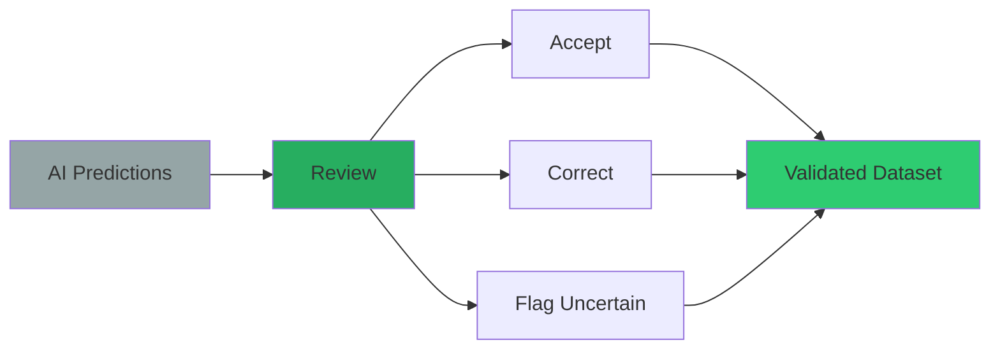
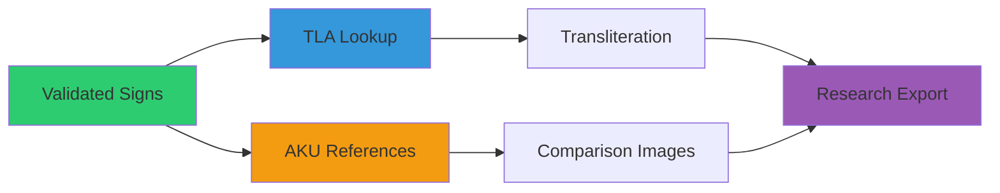
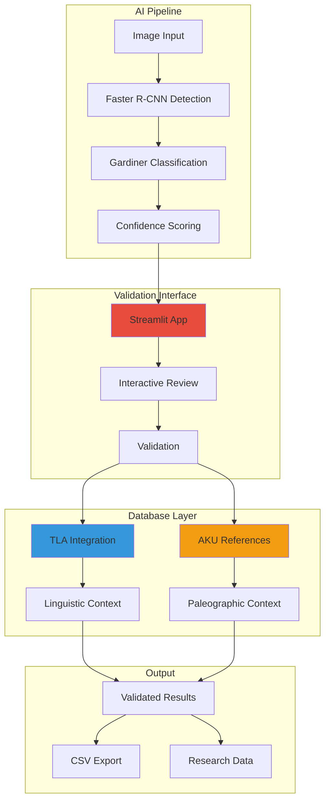

# HieraticAI

**AI-powered hieratic character recognition and validation for ancient Egyptian manuscripts**

[](https://choosealicense.com/licenses/mit/)
[](https://www.python.org/downloads/)
[](https://streamlit.io/)
[](https://github.com/MargotBelot/HieraticAI)

> **Academic Project Notice**: This is a prototype developed for the "Ancient Language Processing" seminar at Freie Universität Berlin (Summer 2025). The project serves as a methodological exploration rather than a production-ready system.
> 
> **Course Information**: [Ancient Language Processing 2025](https://digitalpasts.github.io/alp-course-2025/) - Hybrid seminar focusing on computational approaches to ancient datasets and digital philology methods.

## Table of Contents

- [Quick Start](#quick-start)
- [Project Overview](#project-overview)
- [Interactive Interface](#interactive-validation-interface)
- [Technical Details](#technical-architecture)
- [Documentation](#documentation)

## Project Overview

HieraticAI focuses on the study of ancient Egyptian manuscripts by combining computer vision with Egyptological expertise. This system automatically detects, classifies, and validates hieratic characters in papyrus images, with specialized focus on the **Westcar Papyrus**.

**What makes HieraticAI unique:**
- **AI-First Approach**: Faster R-CNN detection with ResNet-50 backbone across 634 Gardiner code classes
- **Expert Validation**: Interactive interface for Egyptologists to review and correct AI predictions
- **Comprehensive Integration**: Direct links to TLA (Thesaurus Linguae Aegyptiae) and AKU databases
- **Research-Ready**: Exports validated data for paleographic and linguistic research

### The Problem We Solve

Traditional hieratic manuscript analysis is:
- **Time-consuming**: Manual character identification takes a long time for a single manuscript
- **Limited scale**: Impossible to analyze large corpora without automation
- **Subjective**: Difficult to maintain consistency across different scholars

### Our Solution

HieraticAI provides:
- **Automated Detection**: AI identifies and classifies characters in seconds
- **High Accuracy**: Trained specifically on the Westcar papyrus hieratic forms
- **Expert Oversight**: Validation interface ensures rigor
- **Rich Context**: Integrated linguistic and paleographic resources

## How HieraticAI Works: Step-by-Step Process

### Step 1: Image Processing & AI Detection


### Step 2: Interactive Validation & Review


### Step 3: Database Integration & Context


## Manuscript Focus: The Westcar Papyrus

**Westcar Papyrus (pBerlin P 3033)** is a significant Middle Kingdom hieratic manuscript containing tales about magicians at the court of King Khufu.

**Key Details:**
- **Location**: Ägyptisches Museum, Berlin
- **Script**: Hieratic (Middle Egyptian)
- **Content**: 5 stories across 12 columns
- **Training Focus**: Recto VIII, lines 5-24
- **Significance**: Primary source for AI model training and hieratic character evolution research

## Quick Start

### One-Click Installation (Recommended)

**Perfect for anyone - no technical experience required!**

**Prerequisites**: You need Python 3.8+ installed on your system. If you don't have it:
- **Windows/Mac**: Download from [python.org](https://www.python.org/downloads/) 
- **Linux**: Install with `sudo apt install python3 python3-pip` (Ubuntu) or equivalent

1. **Download**: Go to [github.com/MargotBelot/HieraticAI](https://github.com/MargotBelot/HieraticAI) and click "Download ZIP"
2. **Extract**: Unzip the file to your Desktop
3. **Install**: Double-click `install.py` (Windows) or run `python3 install.py` (Mac/Linux)
4. **Launch**: Use the created launcher script when installation completes
5. **Validate**: Your browser opens automatically to start validating!

### Manual Installation (For Experienced Users)

**Requires Python 3.8+**

```bash
git clone https://github.com/MargotBelot/HieraticAI.git
cd HieraticAI
python3 -m venv hieratic_env
# Activate: hieratic_env\Scripts\activate (Win) or source hieratic_env/bin/activate (Mac/Linux)
pip install -r requirements.txt
streamlit run tools/validation/prediction_validator.py
```

**Then navigate to `http://localhost:8501` in your browser!**

## Interactive Validation Interface

### Real-Time Validation Workflow

The HieraticAI interface provides a validation panel:

#### **Main Interface Layout**

**Manuscript Viewer (Left Panel)**
- **Westcar Papyrus Display**: Testing area view with detected signs of the Westcar papyrus facsimile.
- **Color-coded Predictions**:
  - 🔵 ① A1 (85%) - Pending validation
  - 🟢 ② G17 (92%) - High confidence, likely correct
  - 🔴 ③ M17 (76%) - Flagged for review
  - 🟠 ④ D21 (68%) - Medium confidence
  - 🔵 ⑤ N35 (54%) - Low confidence, needs attention
- **Status Tracking**: "2/5 reviewed" with progress indicator

**Validation Panel (Right Panel)**
- **Current Sign Review**:
  - Cropped image of selected sign
  - Gardiner code: A1
  - Unicode display: 𓀀
- **TLA Linguistic Data**:
  - Transliteration information
  - Lemma details and meanings
  - Related sign forms
- **AKU Reference Signs**:
  - Similar signs from database
  - Quality assessment scores
  - SVG vector displays
- **Validation Actions**:
  - **CORRECT** - Confirm AI prediction
  - **INCORRECT** - Mark as wrong
  - **UNCERTAIN** - Flag for further review
  - **EDIT CODE** - Manual correction

**Control Panel (Bottom)**
- Navigation: Previous/Next/Refresh buttons
- Progress: ████▒▒▒ 67% completion

### Validation Status System

|| Color | Status | Meaning |
|-------|--------|---------|
|| 🔵 **Blue** | Pending | Awaiting validation |
|| 🟢 **Green** | Correct | AI prediction is accurate |
|| 🔴 **Red** | Incorrect | AI prediction needs correction |
|| 🟠 **Orange** | Uncertain | Requires expert judgment |

## Database Integration

HieraticAI integrates with two major academic databases to provide context for hieratic character validation:

**AKU-PAL (Altägyptische Kursivschriften)**
- Digital paleography platform from Academy of Sciences, Mainz
- Provides authenticated Westcar Papyrus signs for comparison
- Link: https://aku-pal.uni-mainz.de/

**TLA (Thesaurus Linguae Aegyptiae)**
- Comprehensive lexicographical database of ancient Egyptian
- Provides transliterations, translations, and frequency data
- Ensures 100% coverage through fallback mapping strategies

## Model Performance

| Metric | Value |
|--------|-------|
| **Detection Model** | Faster R-CNN with ResNet-50 backbone |
| **Categories** | 634 Gardiner code classes |
| **mAP Performance** | 31.2% (IoU=0.50:0.95) |
| **Detection Accuracy** | 95% (post category-mapping fix) |
| **TLA Coverage** | 100% (with fallback strategies) |
| **AKU Integration** | Reference signs from Westcar corpus |
| **Validation Interface** | Real-time review |


## Project Structure & File Paths

HieraticAI uses **relative paths** throughout to ensure portability across different systems and users. All paths are resolved relative to the project root directory.

### Required Directory Structure
```
HieraticAI/
├── data/                           # Generated indices and datasets
│   ├── aku_gardiner_index.json     # AKU database index (auto-generated)
│   └── tla_lemma_index.json        # TLA database index (auto-generated)
├── external_data/                  # External database files
│   └── AKU Westcar Scraping/       # AKU Westcar papyrus data
│       ├── json/                   # Metadata files
│       └── svg/                    # Sign vector graphics
├── hieroglyphs_dataset/            # Training dataset
│   ├── train/
│   ├── val/
│   └── test/
├── output/                         # Training outputs and results
│   └── [training_timestamp]/       # Auto-generated training directories
└── tools/                          # Scripts and utilities
```

### Path Portability
- ✅ **All code uses relative paths** - works on Windows, macOS, Linux
- ✅ **No hardcoded usernames** - works for any user
- ✅ **Auto-detection of training outputs** - finds most recent results
- ✅ **Helpful error messages** - guides users to missing files

### Fixing Path Issues
If you encounter path-related errors:

1. **Regenerate AKU index** (fixes absolute path issues):
   ```bash
   python regenerate_aku_index.py
   ```

2. **Verify project structure** matches the layout above

3. **Run from project root** - always execute commands from the HieraticAI directory

## Technical Architecture



## Documentation

- **[Getting Started](GETTING_STARTED.md)**: Step-by-step installation and first use
- **[Technical Guide](TECHNICAL_GUIDE.md)**: Advanced usage, customization, and development

## Acknowledgments

### Academic Context
This prototype was developed as part of the **"Ancient Language Processing" seminar** at **Freie Universität Berlin** (Summer 2025). The course focuses on computational approaches to ancient datasets, digital philology methods, and emerging research questions in ancient Near Eastern studies.

**Course Details:**
- **Institution**: Freie Universität Berlin
- **Course**: Ancient Language Processing 2025
- **Objective**: Methodological exploration of ancient language processing technologies
- **Course Website**: https://digitalpasts.github.io/alp-course-2025/

### Project Status
**Important Note**: This is a **methodological prototype** created for educational and research exploration purposes. It is not intended as a production system but rather as a proof-of-concept for applying modern AI techniques to ancient Egyptian paleographic analysis.

## Contributing

We welcome contributions from Egyptologists, computer vision researchers, and digital humanities scholars, particularly those interested in computational approaches to ancient manuscripts.

## License

This project is licensed under the MIT License - see the [LICENSE](LICENSE) file for details.

## Citation

If you use HieraticAI in your research, please cite:

```bibtex
@software{belotcolyer2025hieraticai,
  title={HieraticAI: AI-powered hieratic character recognition for ancient Egyptian manuscripts},
  author={Belot, Margot and Colyer, Domino},
  year={2025},
  url={https://github.com/MargotBelot/HieraticAI}
}
```
---
