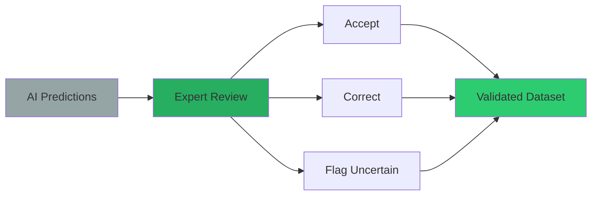

# HieraticAI

**AI-powered hieratic character recognition and validation for ancient Egyptian manuscripts**

[](https://choosealicense.com/licenses/mit/)
[](https://www.python.org/downloads/)
[](https://streamlit.io/)

## Project Overview

HieraticAI revolutionizes the study of ancient Egyptian manuscripts by combining cutting-edge computer vision with deep Egyptological expertise. This system automatically detects, classifies, and validates hieratic characters in papyrus images, with specialized focus on the Middle Kingdom **Westcar Papyrus**.

**What makes HieraticAI unique:**
- **AI-First Approach**: Advanced YOLO-based detection with 84 Gardiner code classes
- **Expert Validation**: Interactive interface for Egyptologists to review and correct AI predictions
- **Comprehensive Integration**: Direct links to TLA (Thesaurus Linguae Aegyptiae) and AKU databases
- **Research-Ready**: Exports validated data for paleographic and linguistic research

### The Problem We Solve

Traditional hieratic manuscript analysis is:
- **Time-consuming**: Manual character identification takes weeks for a single manuscript
- **Error-prone**: Human fatigue leads to inconsistent classifications
- **Limited scale**: Impossible to analyze large corpora without automation
- **Subjective**: Difficult to maintain consistency across different scholars

### Our Solution

HieraticAI provides:
- **Automated Detection**: AI identifies and classifies characters in seconds
- **High Accuracy**: Trained specifically on Middle Kingdom hieratic forms
- **Expert Oversight**: Validation interface ensures scholarly rigor
- **Rich Context**: Integrated linguistic and paleographic resources

## How HieraticAI Works: Step-by-Step Process

### Step 1: Image Processing & AI Detection


### Step 2: Interactive Validation & Expert Review


### Step 3: Database Integration & Context


## Manuscript Focus: The Westcar Papyrus

### Introduction to the Westcar Papyrus

**Westcar Papyrus (pBerlin P 3033)** is one of the most significant Middle Kingdom hieratic manuscripts, containing a collection of tales about magicians at the court of King Khufu.

**Manuscript Details:**
- **Current Location**: Ägyptisches Museum und Papyrussammlung, Berlin
- **Inventory Number**: P 3033
- **Date**: 17th Dynasty, Second Intermediate Period (recounting events from the 4th Dynasty)
- **Script**: Hieratic
- **Language**: Middle Egyptian
- **Text Category**: Narrative literature

**Historical Context:**
- **Setting**: 4th Dynasty (Old Kingdom) under the rule of King Khufu
- **Structure**: 5 stories, each narrated by one of Khufu's sons to their father
- **Physical Structure**: 12 columns across 3 papyrus fragments
- **Literary Significance**: Provides insights into Old Kingdom royal ideology and Middle Kingdom narrative techniques

**Research Focus:**
- **Section Analyzed**: Recto VIII, lines 5-24
- **Paleographic Importance**: Key text for understanding Middle Kingdom hieratic character evolution
- **AI Training Dataset**: Primary source for hieratic character recognition model training

## Quick Start

### 1. Installation
```bash
git clone https://github.com/MargotBelot/HieraticAI.git
cd HieraticAI
conda env create -f environment.yml
conda activate hieratic-ai
```

### 2. Launch Validation Interface
```bash
# Using the reorganized structure
streamlit run tools/validation/prediction_validator.py

# Or install the package and use the command-line tool
pip install -e .
hieratic-validate
```

### 3. Open in Browser
Navigate to `http://localhost:8501` and start validating!

## Interactive Validation Interface

### Real-Time Validation Workflow

The HieraticAI interface provides a seamless experience for expert validation:

```
 MAIN INTERFACE 
                                               
  MANUSCRIPT VIEWER          VALIDATION PANEL 
      
     [Westcar Papyrus]         CURRENT SIGN   
                                                
    ①A1(85%)   [Cropped]     
    🟢②G17(92%)  Gardiner: A1   
    ③M17(76%)  Unicode:     
    🟠④D21(68%)                   
    ⑤N35(54%)  TLA DATA      
                               • Transliteration 
    Status: 2/5 reviewed       • Lemma info     
      • Related forms  
                                                  
  CONTROLS                   AKU REFS     
  Prev  Next  Refresh     • Similar signs  
  Progress:  67%       • Quality score  
                                 • SVG display   
                                                  
                                 ACTIONS       
                                 CORRECT       
                                 INCORRECT     
                                 UNCERTAIN     
                                 EDIT CODE     
                                 

```

### Enhanced Status System

 Symbol  Status  Confidence  Action Required 
--------------------------------------------
   **Pending**  Any  Needs review 
 🟢  **Validated**  High (>80%)  Expert confirmed 
   **Incorrect**  Any  AI prediction wrong 
 🟠  **Uncertain**  Medium  Expert unsure 

### Advanced Validation Features

#### **Smart Navigation**
- **Quick Jump**: Go directly to uncertain or low-confidence predictions
- **Bulk Actions**: Apply corrections to similar signs across the manuscript
- **Progress Tracking**: Visual progress bar with completion statistics

#### **Context-Rich Display**
- **Zoom & Pan**: Detailed examination of character details
- **Measurements**: Pixel-level dimensions and positioning
- **Overlay Options**: Toggle AI predictions, ground truth, reference grids

#### **Expert Tools**
- **Manual Correction**: Edit Gardiner codes directly
- **Notes System**: Add scholarly comments and observations
- **Cross-References**: Link to related signs in other manuscripts

### Color-Coded Status System

 Color  Status  Meaning 
------------------------
  **Blue**  Pending  Awaiting validation 
 🟢 **Green**  Correct  AI prediction is accurate 
  **Red**  Incorrect  AI prediction needs correction 
 🟠 **Orange**  Uncertain  Requires expert judgment 

## Database Integration

HieraticAI integrates with two major academic databases to provide comprehensive linguistic and paleographic context for hieratic character validation.

### AKU-PAL (Altägyptische Kursivschriften)

#### About AKU-PAL
**Full Name**: Dynamische Paläographie des Hieratischen und der Kursivhieroglyphen  
**Link**: https://aku-pal.uni-mainz.de/  
**Institution**: Academy of Sciences and Literature, Mainz  
**Purpose**: Online platform featuring digital paleography of hieratic and cursive hieroglyphs

#### Integration Features
**Westcar Papyrus Filtering:**
- **Date Filter**: "Second Intermediate Period, 17th Dynasty"
- **Source Filter**: "Berlin, Egyptian Museum and Papyrus Collection, P. 3033"
- **Sorting Options**: Manuel de Codage (MdC), Moller No., AKU No., Date

**Metadata Extraction:**
- **Dating**: Precise chronological placement for paleographic comparison
- **Manuscript Title**: Ensures signs are sourced from the Westcar Papyrus corpus
- **Quality Assessment**: Readability, completeness, and ink clarity ratings
- **Visual Resources**: High-quality facsimiles and photographic snippets

**Research Applications:**
- **Paleographic Comparison**: Compare AI predictions with authenticated Westcar signs
- **Diachronic Analysis**: Track character evolution within the manuscript tradition
- **Quality Validation**: Cross-reference with expert-curated paleographic data

### TLA (Thesaurus Linguae Aegyptiae) Integration

#### About TLA
**Purpose**: Comprehensive lexicographical database of ancient Egyptian language  
**Content**: Scraped metadata including transliterations, translations, and frequency data  
**Coverage**: Extensive lemma database with hierarchical sign relationships

#### Integration Architecture
```mermaid
graph LR
    A[Gardiner Code] --> B{TLA Direct Match?}
    B -->Yes C[Lemma Data]
    B -->No D{Similar Sign?}
    D -->Yes E[Fallback Mapping]
    D -->No F{Manual Entry?}
    F -->Yes G[Curated Data]
    F -->No H[Gardiner Classification]
    
    C --> I[100% Coverage]
    E --> I
    G --> I
    H --> I
    
    style I fill:#27ae60
```

**Coverage Strategy:**
1. **Direct TLA Match**: Authentic lemma data with transliteration and translation
2. **Fallback Mapping**: Similar sign substitution (e.g., A23A → A23)
3. **Manual Entries**: Expert-curated data for missing signs
4. **Gardiner Fallback**: Basic classification as last resort

**Scraped Metadata Include:**
- **Transliteration**: Conventional romanization of hieratic signs
- **Translation**: English meanings and semantic ranges
- **Frequency Data**: Usage statistics across the Egyptian corpus
- **Lemma Relationships**: Connections to related lexical entries

### Database Synchronization

**Automated Indexing:**
- AKU-PAL signs filtered by Westcar Papyrus provenance
- TLA lemma data indexed by Gardiner code classification
- Cross-referencing between paleographic and linguistic data

**Real-time Integration:**
- Live database queries during validation sessions
- Cached results for performance optimization
- Fallback mechanisms ensure 100% coverage

## Model Performance

 Metric  Value 
---------------
 **Detection Model**  YOLO-based object detection 
 **Categories**  84 Gardiner code classes 
 **TLA Coverage**  100% (with fallback strategies) 
 **AKU Integration**  Reference signs from Westcar corpus 
 **Validation Interface**  Real-time expert review 

## Academic Applications

### Research Use Cases
- **Digital Paleography**: Character evolution and regional variations
- **Corpus Analysis**: Large-scale analysis of hieratic manuscripts

### Integration Possibilities
- **Museum Collections**: Digitization and cataloging assistance
- **Digital Humanities**: Integration with manuscript databases
- **Egyptology Workflows**: Support for epigraphic documentation

## Technical Architecture


## Documentation

- **[Getting Started](GETTING_STARTED.md)**: Step-by-step installation and first use
- **[Technical Guide](TECHNICAL_GUIDE.md)**: Advanced usage, customization, and development

## Contributing

We welcome contributions from Egyptologists, computer vision researchers, and digital humanities scholars. 

## License

This project is licensed under the MIT License - see the [LICENSE](LICENSE) file for details.

## Citation

If you use HieraticAI in your research, please cite:

```bibtex
@software{belotcolyer2025hieraticai,
  title={HieraticAI: AI-powered hieratic character recognition for ancient Egyptian manuscripts},
  author={Belot, Margot and Colyer, Domino},
  year={2025},
  url={https://github.com/MargotBelot/HieraticAI}
}
```
---
