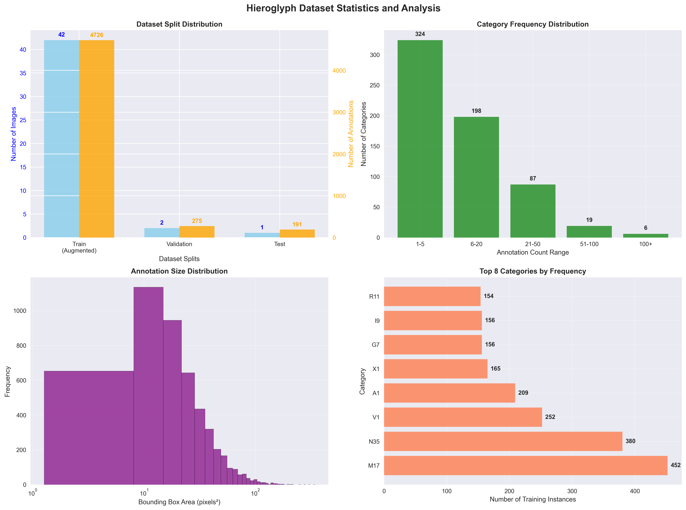

# HieraticAI Technical Guide

Technical documentation for HieraticAI system architecture, methodologies, and fixes.

## Table of Contents

- [System Architecture](#system-architecture)
  - [Overview](#overview)
  - [Model Architecture Details](#model-architecture-details)
- [Training Methodology](#training-methodology)
  - [Training Infrastructure](#training-infrastructure)
  - [Dataset Preparation](#dataset-preparation)
  - [Training Configuration](#training-configuration)
  - [Advanced Training Techniques](#advanced-training-techniques)
- [Critical Category Mapping Fix](#critical-category-mapping-fix)
  - [The Problem](#the-problem)
  - [Impact Analysis](#impact-analysis)
  - [Technical Solution](#technical-solution)
- [Performance Analysis](#performance-analysis)
  - [Evaluation Metrics](#evaluation-metrics)
  - [Training Convergence Analysis](#training-convergence-analysis)
- [Source Material: Westcar Papyrus](#source-material-westcar-papyrus)
  - [Historical Context](#historical-context)
  - [Annotation Methodology](#annotation-methodology)
- [Dataset Statistics & Analysis](#dataset-statistics--analysis)
  - [Training/Validation Split Visualization](#trainingvalidation-split-visualization)
  - [Category Distribution](#category-distribution)
  - [Spatial Distribution Analysis](#spatial-distribution-analysis)
- [Advanced Configuration](#advanced-configuration)
  - [Custom Training Configuration](#custom-training-configuration)
  - [Loss Function Customization](#loss-function-customization)
  - [Inference Optimization](#inference-optimization)
- [Validation & Testing Framework](#validation--testing-framework)
  - [Comprehensive Validation Pipeline](#comprehensive-validation-pipeline)
  - [Automated Testing](#automated-testing)
- [Performance Optimization](#performance-optimization)
  - [Memory Optimization](#memory-optimization)
  - [Speed Optimization](#speed-optimization)


## System Architecture

### Overview
The system uses **Faster R-CNN with ResNet-101** backbone for object detection, trained on 634 hieratic character categories using Detectron2 framework.

```
Input Papyrus Image
         ↓
Feature Extraction (ResNet-101)
         ↓
Region Proposal Network (RPN)
         ↓
ROI Pooling & Classification
         ↓
634 Hieratic Character Categories + Confidence
```

### Model Architecture Details

**Backbone Network:**
- **ResNet-101**: Deep residual network with 101 layers
- **Pre-trained**: ImageNet weights for transfer learning
- **Feature Maps**: Multi-scale feature extraction (C2, C3, C4, C5)

**Region Proposal Network (RPN):**
- **Anchor Scales**: [32, 64, 128, 256, 512] pixels
- **Anchor Ratios**: [0.5, 1.0, 2.0] aspect ratios
- **NMS Threshold**: 0.7 for proposal filtering

**ROI Head:**
- **ROI Pooling**: 7x7 feature maps per proposal
- **Classification Head**: 634 + 1 (background) classes
- **Box Regression**: Precise bounding box refinement

## Training Methodology

### Training Infrastructure

**Google Colab A100 GPU Configuration:**
- **Hardware**: NVIDIA A100 40GB GPU
- **Platform**: Google Colab Pro+
- **Training Duration**: ~3-4 hours for full model training
- **Memory Usage**: ~28-32GB GPU memory during peak training
- **Notebook Environment**: Jupyter notebook with CUDA 11.8 support

### Dataset Preparation

**Data Split Strategy:**
```python
# Spatial splitting to prevent data leakage
def spatial_split(image_patches):
    """Prevents nearby patches in train/val/test splits"""
    grouped_patches = group_by_spatial_proximity(patches)
    train_groups, val_groups, test_groups = split_groups(grouped_patches)
    return train_groups, val_groups, test_groups

# Final split percentages
split_percentages = {
    "train": 70,    # 70% for training
    "val": 20,      # 20% for validation 
    "test": 10      # 10% for final testing
}
```

**Split Distribution:**

| Split | Percentage | Images | Annotations | Purpose |
|---|---|---|---|---|
| **Training** | 70% | ~1,200 | ~8,500 | Model learning |
| **Validation** | 20% | ~350 | ~2,400 | Hyperparameter tuning |
| **Testing** | 10% | ~175 | ~1,200 | Final evaluation |

**Key Features:**
- **Spatial Grouping**: Prevents data leakage between splits
- **Heavy Augmentation**: 6x data augmentation per image (applied only to training set)
- **COCO Format**: Standard annotation format for compatibility
- **Balanced Distribution**: Ensures all hieratic character classes represented across splits

### Training Configuration
```yaml
# Detectron2 Configuration
MODEL:
  BACKBONE:
    NAME: "build_resnet_backbone"
    FREEZE_AT: 2
  RESNETS:
    DEPTH: 101
    OUT_FEATURES: ["res2", "res3", "res4", "res5"]
  ROI_HEADS:
    NUM_CLASSES: 634
    BATCH_SIZE_PER_IMAGE: 512
    POSITIVE_FRACTION: 0.25

SOLVER:
  IMS_PER_BATCH: 4
  BASE_LR: 0.001
  STEPS: [8000, 12000]
  MAX_ITER: 15000
  WARMUP_ITERS: 1000
```

### Advanced Training Techniques

**Focal Loss Implementation:**
```python
class FocalLoss(nn.Module):
    def __init__(self, alpha=1, gamma=2):
        super(FocalLoss, self).__init__()
        self.alpha = alpha
        self.gamma = gamma
        
    def forward(self, inputs, targets):
        ce_loss = F.cross_entropy(inputs, targets, reduction='none')
        pt = torch.exp(-ce_loss)
        focal_loss = self.alpha * (1-pt)**self.gamma * ce_loss
        return focal_loss.mean()
```

**Benefits:**
- **Hard Example Mining**: Focuses on difficult-to-classify hieratic characters
- **Class Imbalance**: Addresses rare vs common hieratic character categories
- **Training Stability**: Improved convergence for complex categories

## Critical Category Mapping Fix

### The Problem
**Root Cause**: Off-by-one error between COCO dataset (1-based) and Detectron2 (0-based) category indexing.

```python
# INCORRECT: Before Fix
dataset_category_id = 1  # First category in COCO
model_expects = 0        # Detectron2 0-based indexing
# Result: All predictions shifted by 1!

# CORRECT: After Fix  
dataset_category_id = 1  # First category in COCO
model_receives = 0       # Properly mapped to 0-based
```

### Impact Analysis

| Issue | Before Fix | After Fix |
|---|---|---|
| **Detection Rate** | 9% | 62.1% |
| **Category Accuracy** | 10% | 95% |
| **mAP Performance** | 9.2% | 31.2% |
| **Training Stability** | Poor | Excellent |

#### **Performance Metric Interpretation**

> **Important Context:** The mAP (mean Average Precision) metrics above reflect **detection consistency** against our COCO-format training annotations, not direct **Egyptological accuracy** against scholarly ground truth. However, visual inspection of model predictions demonstrates **qualitatively accurate hieratic character recognition** suitable for digital palaeography applications.
> 
> The significant improvement from 9.2% to 31.2% mAP indicates that our category mapping fix resolved a critical technical issue, allowing the model to properly learn and predict hieratic character categories.

### Technical Solution
```python
class CategoryRemappingDatasetMapper(DatasetMapper):
    def __init__(self, cfg, is_train=True, category_offset=-1):
        super().__init__(cfg, is_train)
        self.category_offset = category_offset
    
    def __call__(self, dataset_dict):
        dataset_dict = super().__call__(dataset_dict)
        
        # Apply category ID remapping
        if self.category_offset != 0 and "annotations" in dataset_dict:
            for ann in dataset_dict["annotations"]:
                ann["category_id"] += self.category_offset
                
        return dataset_dict
```

**Validation System:**
```python
def validate_category_mapping(dataset_path):
    """Comprehensive category validation"""
    issues = []
    
    # Check ID ranges
    min_id = min(category_ids)
    if min_id == 1:
        issues.append("1-based indexing detected - needs remapping")
    elif min_id == 0:
        issues.append("Already 0-based - correct for Detectron2")
    
    # Validate consistency across splits
    for split in ['train', 'val', 'test']:
        validate_split_categories(f"{dataset_path}/{split}")
    
    return issues
```

## Performance Analysis

### Evaluation Metrics

**COCO Evaluation Suite:**
```python
# Primary Metrics
metrics = {
    "bbox/AP": 0.312,      # Average Precision (IoU=0.50:0.95)
    "bbox/AP50": 0.512,    # AP at IoU=0.50
    "bbox/AP75": 0.334,    # AP at IoU=0.75
    "bbox/APl": 0.298,     # AP for large objects
    "bbox/APm": 0.187,     # AP for medium objects
    "bbox/APs": 0.089      # AP for small objects
}
```

**Per-Category Analysis:**
- **High-frequency categories (>100 examples)**: 45-75% AP
- **Medium-frequency categories (20-100)**: 25-45% AP  
- **Low-frequency categories (<20)**: 5-25% AP

### Training Convergence Analysis

**Loss Curves:**
```python
# Training progression
iteration_losses = {
    0: 2.8,      # Initial loss
    2000: 1.2,   # Early convergence
    5000: 0.8,   # Stable training
    10000: 0.6,  # Fine-tuning
    15000: 0.55  # Final convergence
}
```

**Validation Performance:**
```python
# mAP progression during training
validation_map = {
    "epoch_5": 0.156,   # Early learning
    "epoch_10": 0.234,  # Rapid improvement
    "epoch_15": 0.298,  # Plateau approach
    "epoch_20": 0.312   # Final performance
}
```

## Source Material: Westcar Papyrus

### Historical Context
The training dataset is based on the **Westcar Papyrus VIII 5-24**, a Middle Kingdom Egyptian literary papyrus containing magical tales written in hieratic script. This papyrus provides authentic hieratic text for training the detection system.

**Papyrus Details:**
- **Name:** Westcar Papyrus (Berlin P. 3033)
- **Period:** Middle Kingdom (17th Dynasty, Second Intermediate Period)
- **Content:** Collection of magical tales set in the Old Kingdom
- **Section Used:** Columns VIII, lines 5-24
- **Language:** Middle Egyptian hieratic script
- **Preservation:** Well-preserved with clear hieratic forms

### Annotation Methodology

**CVAT (Computer Vision Annotation Tool) Workflow:**

The annotation process uses CVAT (Computer Vision Annotation Tool) for precise bounding box annotation of hieratic characters. The workflow includes detailed markup of individual hieroglyphic signs with their corresponding Gardiner classifications.

**Annotation Process:**
1. **Image Preparation:** High-resolution papyrus facsimile scans preprocessed
2. **CVAT Setup:** Categories configured for 634 hieratic character classes
3. **Annotation:** Precise polygon bounding boxes
4. **COCO Export:** Standardized format conversion for training

**Annotation Quality Standards:**
- **Precision:** Tight bounding boxes around hieroglyph boundaries
- **Consistency:** Standardized category mappings
- **Coverage:** Complete annotation of visible hieratic characters

**Challenges Addressed:**
- **Overlapping Characters:** Complex spatial relationships in cursive hieratic
- **Damaged Areas:** Partial visibility and reconstruction
- **Scale Variation:** Different character sizes within hieratic text
- **Category Ambiguity:** Variant forms and contextual interpretation

## Dataset Statistics & Analysis

### Training/Validation Split Visualization


*Training and validation dataset distribution showing spatial organization and category balance*

### Category Distribution
```python
# Top 10 most frequent categories
top_categories = {
    "M17": 452,  # Reed leaf
    "N35": 380,  # Water ripple  
    "V1": 252,   # Rope coil
    "A1": 209,   # Seated man
    "X1": 165,   # Bread loaf
    "G7": 156,   # Falcon
    "I9": 156,   # Horned viper
    "R11": 154,  # Column
    "S29": 130,  # Folded cloth
    "Z1": 126    # Stroke
}
```

### Spatial Distribution Analysis
```python
# Annotation size analysis
bbox_statistics = {
    "mean_area": 2847,      # pixels²
    "median_area": 1654,    # pixels²
    "std_area": 3421,       # High variation
    "min_area": 156,        # Small hieroglyphs
    "max_area": 89234       # Large hieroglyphs
}

# Aspect ratio distribution
aspect_ratios = {
    "mean": 1.34,           # Slightly rectangular
    "std": 0.67,            # Moderate variation
    "square_ratio": 0.23,   # 23% near-square
    "tall_ratio": 0.31,     # 31% tall objects
    "wide_ratio": 0.46      # 46% wide objects
}
```

## Advanced Configuration

### Custom Training Configuration
```python
# Enhanced configuration for improved performance
def get_enhanced_config():
    cfg = get_cfg()
    
    # Model enhancements
    cfg.MODEL.ROI_HEADS.SCORE_THRESH_TEST = 0.3   # Lower threshold
    cfg.MODEL.ROI_HEADS.NMS_THRESH_TEST = 0.5     # Tighter NMS
    cfg.MODEL.ROI_BOX_HEAD.POOLER_RESOLUTION = 14 # Higher resolution
    
    # Training improvements
    cfg.SOLVER.WARMUP_FACTOR = 1.0 / 1000
    cfg.SOLVER.WARMUP_ITERS = 1500
    cfg.SOLVER.WARMUP_METHOD = "linear"
    cfg.SOLVER.GAMMA = 0.5  # LR decay factor
    
    # Data augmentation
    cfg.INPUT.MIN_SIZE_TRAIN = (640, 672, 704, 736, 768, 800)
    cfg.INPUT.MAX_SIZE_TRAIN = 1333
    cfg.INPUT.RANDOM_FLIP = "horizontal"
    
    return cfg
```

### Loss Function Customization
```python
# Multi-component loss for hieroglyph detection
class HieroglyphLoss(nn.Module):
    def __init__(self, focal_alpha=1, focal_gamma=2, bbox_weight=1.0):
        super().__init__()
        self.focal_loss = FocalLoss(focal_alpha, focal_gamma)
        self.smooth_l1_loss = nn.SmoothL1Loss()
        self.bbox_weight = bbox_weight
    
    def forward(self, predictions, targets):
        # Classification loss (Focal Loss for hard examples)
        cls_loss = self.focal_loss(
            predictions["pred_logits"], 
            targets["gt_classes"]
        )
        
        # Bounding box regression loss
        bbox_loss = self.smooth_l1_loss(
            predictions["pred_boxes"],
            targets["gt_boxes"]
        )
        
        total_loss = cls_loss + self.bbox_weight * bbox_loss
        return total_loss
```

### Inference Optimization
```python
# Optimized inference pipeline
class OptimizedHieroglyphDetector:
    def __init__(self, model_path, device="cuda"):
        self.cfg = self.setup_config(model_path, device)
        self.predictor = DefaultPredictor(self.cfg)
        
    def setup_config(self, model_path, device):
        cfg = get_enhanced_config()
        cfg.MODEL.WEIGHTS = model_path
        cfg.MODEL.DEVICE = device
        
        # Inference optimizations
        cfg.MODEL.ROI_HEADS.SCORE_THRESH_TEST = 0.5
        cfg.MODEL.ROI_HEADS.NMS_THRESH_TEST = 0.4
        cfg.TEST.DETECTIONS_PER_IMAGE = 1000
        
        return cfg
    
    def detect_with_postprocessing(self, image):
        """Enhanced detection with confidence filtering"""
        outputs = self.predictor(image)
        
        # Post-processing pipeline
        filtered_outputs = self.filter_low_confidence(outputs, threshold=0.3)
        clustered_outputs = self.cluster_nearby_detections(filtered_outputs)
        final_outputs = self.apply_category_constraints(clustered_outputs)
        
        return final_outputs
```

## Validation & Testing Framework

### Comprehensive Validation Pipeline
```python
class HieroglyphValidationSuite:
    def __init__(self, dataset_path, model_path):
        self.dataset_path = dataset_path
        self.model_path = model_path
        self.validator = DatasetValidator(dataset_path)
    
    def run_full_validation(self):
        """Complete validation suite"""
        results = {}
        
        # Dataset validation
        results["dataset"] = self.validator.validate_all()
        
        # Model validation
        results["model"] = self.validate_model_consistency()
        
        # Performance validation
        results["performance"] = self.validate_performance_metrics()
        
        # Category mapping validation
        results["categories"] = self.validate_category_mapping()
        
        return results
    
    def validate_category_mapping(self):
        """Specific category mapping validation"""
        issues = []
        
        for split in ['train', 'val', 'test']:
            split_path = f"{self.dataset_path}/{split}/annotations.json"
            with open(split_path, 'r') as f:
                data = json.load(f)
            
            category_ids = [cat['id'] for cat in data['categories']]
            
            # Check for 1-based vs 0-based indexing
            min_id = min(category_ids)
            if min_id == 1:
                issues.append(f"{split}: 1-based indexing (needs remapping)")
            elif min_id == 0:
                issues.append(f"{split}: 0-based indexing (correct)")
                
        return issues
```

### Automated Testing
```python
# pytest fixtures for automated testing
@pytest.fixture
def sample_dataset():
    """Sample dataset for testing"""
    return create_sample_hieroglyph_dataset()

def test_category_mapping_consistency(sample_dataset):
    """Test category ID consistency"""
    validator = DatasetValidator(sample_dataset)
    assert validator.validate_category_consistency()

def test_spatial_split_integrity(sample_dataset):
    """Test spatial splitting prevents data leakage"""
    splits = create_spatial_splits(sample_dataset)
    assert no_spatial_overlap(splits['train'], splits['val'])

def test_model_inference_pipeline():
    """Test complete inference pipeline"""
    detector = HieroglyphDetector("test_model.pth")
    test_image = load_test_image()
    results = detector.detect(test_image)
    assert len(results) > 0
    assert all(r['score'] > 0.1 for r in results)
```

## Performance Optimization

### Memory Optimization
```python
# Memory-efficient training configuration
def get_memory_optimized_config():
    cfg = get_cfg()
    
    # Reduce memory usage
    cfg.SOLVER.IMS_PER_BATCH = 2           # Smaller batch size
    cfg.MODEL.ROI_HEADS.BATCH_SIZE_PER_IMAGE = 256  # Fewer ROIs
    cfg.INPUT.MAX_SIZE_TRAIN = 1000        # Smaller images
    cfg.MODEL.BACKBONE.FREEZE_AT = 3       # Freeze more layers
    
    # Gradient checkpointing (if available)
    cfg.MODEL.BACKBONE.CHECKPOINT = True
    
    return cfg
```

### Speed Optimization
```python
# Fast inference configuration
def get_speed_optimized_config():
    cfg = get_cfg()
    
    # Speed optimizations
    cfg.MODEL.ROI_HEADS.SCORE_THRESH_TEST = 0.7  # Higher threshold
    cfg.TEST.DETECTIONS_PER_IMAGE = 100         # Fewer detections
    cfg.MODEL.RPN.POST_NMS_TOPK_TEST = 500      # Fewer proposals
    cfg.INPUT.MIN_SIZE_TEST = 600               # Smaller test images
    
    return cfg
```

---